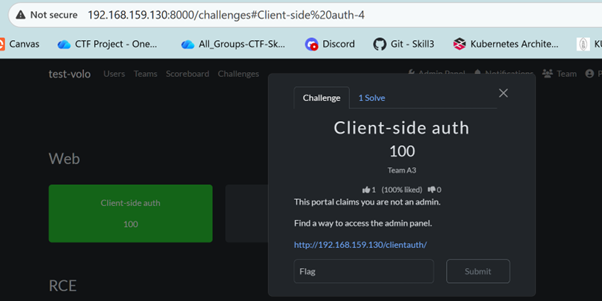
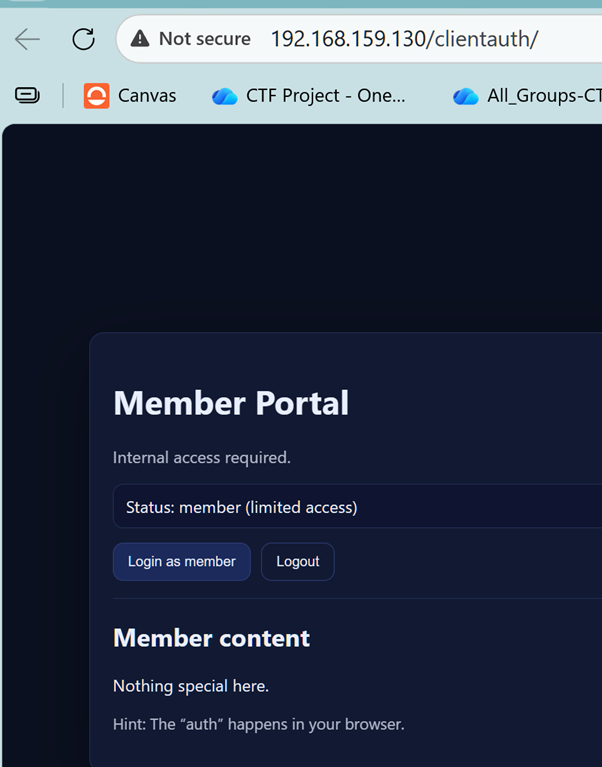

Client-Side Auth (Beginner Web CTF) — Full Admin Guide
Goal of the challenge

Teach that client-side authorization is not security by storing a user role in localStorage and trusting it in JavaScript.

Players must modify browser storage to become admin and reveal the flag.

# PART 1 — Prerequisites

CTFd running via Docker Compose

nginx reverse proxy in front of CTFd

Admin access to CTFd

ctf CLI already used for other challenges (event repo exists)

PART 2 — Create the challenge website (static files)
## 2.1 Create the directory (on the host)

From the CTFd project directory (where docker-compose.yml is):

mkdir -p ~/CTFd/challenges/clientauth
cd ~/CTFd/challenges/clientauth

## 2.2 Create index.html
--> see challenge dir
## 2.3 Create app.js
--> see challenge dir
## 2.4 Create style.css (optional, cosmetic)
--> see challenge dir

# PART 3 — Host the website via Docker/nginx
## 3.1 Add static container to docker-compose.yml

Add once (at same level as "service"):

static-challenges:
  image: nginx:alpine
  restart: always
  volumes:
    - ./challenges:/usr/share/nginx/html:ro

## 3.2 Update nginx reverse proxy

--> see challenge dir for ready file

(or you can do it yourself)
Edit ./conf/nginx/http.conf (path: ~/CTFd/conf/nginx/http.conf)

Inside the existing server {} block:

location /clientauth/ {
  proxy_pass http://static-challenges/clientauth/;
  proxy_set_header Host $host;
}

## 3.3 Restart containers
cd ~/CTFd
sudo docker-compose up -d
sudo docker-compose restart nginx

## 3.4 Verify hosting works

Open in browser:

http://<server-ip>/clientauth/

You should see Member Portal.

PART 4 — Create the CTFd challenge (using ctf CLI)

Website hosting and CTFd challenge creation are separate.

## 4.1 Go to your event repository
cd ~/my_event

Verify:

ls .ctf

## 4.2 Create challenge folder (PRIVATE)
mkdir -p challenges/web/client-side-auth
cd challenges/web/client-side-auth

4.3 Create challenge.yml
name: Client-side auth
category: Web
value: 300
description: |
  This portal claims you are not an admin.

  Find a way to access the admin panel.

  http://<server-ip>/clientauth/
flags:
  - ctf{client_side_auth_is_not_security}
state: hidden

## 4.4 Add challenge to event

From the event root:

cd ~/my_event
ctf challenge add challenges/web/client-side-auth

## 4.5 Install or sync
First time only:
ctf challenge install

After that (normal usage):
ctf challenge sync

install fails if the challenge already exists — this is expected behavior.

# PART 5 — Player solution (intended)
## Method 1 — Local Storage (intended path)

## In CTFd portal --> open Web challenge

## Open challenge URL

## Click Login as member (login doesnt work, so read hint)

Open DevTools → Application

Go to Local Storage → /clientauth

Change key-value:

role = member

to:

role = admin

Refresh page

Flag appears

## Method 2 — Console (faster)
localStorage.setItem("role", "admin");
location.reload();
